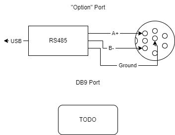

# EmuBKM-10r
A Python Module and Command Line Interface that replaces the Sony BKM-10r

The EmuBKM-10R is a python script that provides a class and command line interface to those who wish to encorperate BVM control from any PC or computer. 

To get started, you need to connect the BVM to a PC via serial. This can be done either create custom serial cable or getting a simple rs485 usb serial adapter.

This is the serial adapter I use for simple testing purposes: https://www.amazon.com/USB-RS485-Applications-Communication-Requirement/dp/B081NBCJRS/ref=sr_1_3_pp?crid=2BP96KJD499W4&keywords=rs485+usb&qid=1704225950&sprefix=rs485%2Caps%2C121&sr=8-3

With this adapter, you will need to get a few breadboard jumper cables, such as the ones here: https://www.amazon.com/Elegoo-EL-CP-004-Multicolored-Breadboard-arduino/dp/B01EV70C78/ref=pd_bxgy_d_sccl_1/147-1497522-9630642?pd_rd_w=YbrK6&content-id=amzn1.sym.101c7dca-f8ef-4330-838b-ed6e9ebb9e52&pf_rd_p=101c7dca-f8ef-4330-838b-ed6e9ebb9e52&pf_rd_r=XH5EXG7BT74R0A001STY&pd_rd_wg=4nww1&pd_rd_r=c75bb635-5c87-4134-a6ef-9d4d7cddf5dd&pd_rd_i=B01EV70C78&psc=1

Below are the wiring diagrams for both the front "Option" din port and the DB9 connector on the rear of the monitor:

After connecting the BVM to the PC, you can either run the python script as is or import the EmuBKM10r Class into any other python script. 

There are two command line arguments:

-p (--Port) for the port on which the USB serial device is connected

-c (--Command) for a single command to be run, instead of starting up the CLI interface

Example: python EmuBKM-10r.py -p COM9 -c Menu

Below are the commands available currently:

IEN - Swap to Encoder Bank

ISW - Swap to Switch Bank

ILE - Swap to LED Bank

ICC - Unknown

IMT - Unknown

Shift - Shift Key

Overscan - Toggles Overscan Mode

16 -9 - Toggles 16 -9 Mode

HorizSync - Toggles Horizontal Sync Shift

Sync - Toggles Sync Mode

VertSync - Toggles Vertical Sync Shift

BlueOnly - Toggles Blue-Gun Only 

Mono - Toggles Mono

Red - Toggles on/off Red Gun

Aperature - Toggles Aperature Adjustment

Green - Toggles on/off Green Gun

Comb - Toggles Comb Filter for Composite/Svideo

Blue - Toggles on/off Blue Gun

F1 - Function 1

F3 - Function 2

F2 - Function 3

F4 - Function 4

SafeArea -  Toggles Current Safe Area Marker

Address - Brings up Address Menu

Up - Presses Up Button

Down - Presses Down Button

Enter - Presses Enter Button

Menu - Presses Menu Button

Num0 - Presses 0 on Number Pad

Num1 - Presses 1 on Number Pad

Num2 - Presses 2 on Number Pad

Num3 - Presses 3 on Number Pad

Num4 - Presses 4 on Number Pad

Num5 - Presses 5 on Number Pad

Num6 - Presses 6 on Number Pad

Num7 - Presses 7 on Number Pad

Num8 - Presses 8 on Number Pad

Num9 - Presses 9 on Number Pad

Power - Presses Power Button

Degauss - Presses Deguass Button

PhaseInc - Turns Phase Knob (Not Implemented Yet)

ChromaInc - Turns Chroma Knob (Not Implemented Yet)

BrightInc - Turns Brightness Knob (Not Implemented Yet)

ContrastInc - Turns Contrast Knob (Not Implemented Yet)

UpdateChannelName - Channel Update Feature (CLI Only!)

For additional questions, or just want to discuss the potential for Automatic control over BVMs, feel free to email me at andy.gatza@gmail.com
